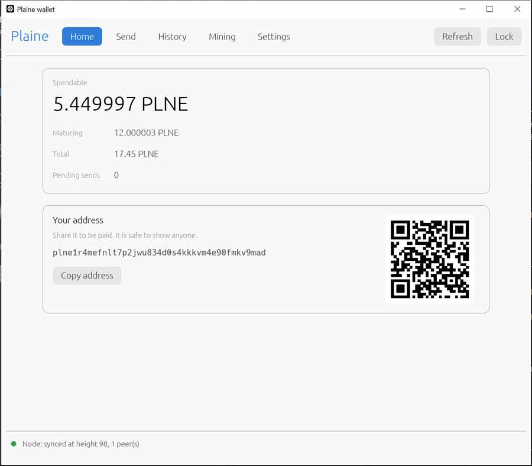

# Plaine

Plaine is a proof-of-work coin mined with ordinary processors. Its algorithm, Isochron,
runs well on a CPU and badly on GPUs and ASICs, so every CPU earns for the work it does.
A block every 60 seconds pays a flat 0.2 PLNE: no supply cap, no premine, no presale, no
developer fund. With a fixed reward and a growing supply, inflation falls toward zero
year by year.

This repository, **danifest751/plaine**, is a fork of
[noaltitude/plaine](https://github.com/noaltitude/plaine) with the same consensus: a
block or transaction valid for one is valid for the other. It adds a desktop wallet, the
node and wallet work that wallet needs, a faster miner that also runs on Android phones,
and tests up to end-to-end runs on a real node. What differs from upstream, and every
upstream defect fixed here, is in [FORK.md](FORK.md).



## Download

Builds for Windows, Linux and Android are on the
[releases page](https://github.com/danifest751/plaine/releases), with a `SHA256SUMS` file.
Each binary names the commit it was built from (`--version`).

| archive | contents |
|---|---|
| `…-windows-x86_64.zip` | node, desktop wallet, command-line wallets, miner, start scripts |
| `…-linux-x86_64.tar.gz` | node, command-line wallet, miner (static binaries) |
| `…-android-arm64.zip` | the miner for 64-bit Android phones |

## Quick start

With the Windows archive unpacked:

1. **Run a node.** `start-node.bat`. It finds the network through built-in seeds and
   downloads the chain.
2. **Open the wallet.** `plaine-wallet-gui.exe`. Create a key, write down the backup
   string it shows once, and your address is on the Home screen.
3. **Mine.** In the wallet's Mining tab, press *Start mining*; or mine on a pool with
   `mine-pool.bat`.

The [user guide](docs/USER_GUIDE.md) walks through every screen, pool mining, mining on a
phone, and the command line.

### From the command line

```
plaine-noded                                             # the node
plaine-wallet new --role spend --out my.plnekey \
    --passphrase-file pass.txt                           # prints your address
plaine-miner plne1youraddress                            # mines to the local node
plaine-miner plne1youraddress.rig@eu.rplant.xyz:17190    # or to a pool
```

The command-line wallet never opens a socket: it prints a signed transaction as hex for
the node's RPC (`tx_sendRaw`), and takes `--nonce` and `--fee` from you. `--help` on any
program lists the rest.

## The coin

| | |
|---|---|
| algorithm | Isochron v1: integer-only, a 64 KiB scratchpad per thread and a program rebuilt for every hash, which the miner JIT-compiles |
| block time | 60 seconds, ASERT difficulty adjustment |
| block reward | 0.2 PLNE, flat, forever; no cap |
| unit | 1 PLNE = 1,000,000 mile |
| coinbase maturity | 60 blocks |
| deepest reorg accepted | 30 blocks |
| accounts | ed25519 keys, nonces; bech32m addresses starting `plne1` |

The full rules are in [SPEC.md](SPEC.md).

## Node

```
plaine-noded                  # data in %APPDATA%\Plaine on Windows, ~/.plaine elsewhere
plaine-noded --print-config   # every setting, and where its value came from
```

It listens for peers on port 9256, serves JSON-RPC on `127.0.0.1:9257` and a stratum
mining server on `127.0.0.1:9258`, reachable from this machine only. Useful settings in
`noded.toml`:

| setting | what it does |
|---|---|
| `[node] addrindex = true` | per-address transaction history, `account_getHistory`; the desktop wallet's History tab needs it |
| `[node] txindex = true` | find any transaction by id |
| `[node] prune = false` | keep every block body (the default keeps recent ones) |
| `[stratum] listen = "0.0.0.0:9258"` | let miners on other machines connect |

Every RPC method, with parameters, results and errors, is in [docs/rpc.md](docs/rpc.md).

## Build from source

Rust 1.85 or newer.

```
cargo build --release                                           # node, wallet
cargo build --release --manifest-path miner/Cargo.toml          # miner
cargo build --release --manifest-path wallet-gui/Cargo.toml     # desktop wallet
scripts/build-android.sh                                        # miner for Android (NDK)
```

On Windows with the GNU toolchain, see the notes in [FORK.md](FORK.md#building).
`scripts/check.sh` runs every test and lint a change must pass; `--e2e` adds the
end-to-end runs against a real node and miner.

## Documentation

- [docs/USER_GUIDE.md](docs/USER_GUIDE.md): the desktop wallet, mining, phones, the
  command line
- [docs/rpc.md](docs/rpc.md): the node's JSON-RPC reference
- [SPEC.md](SPEC.md): the consensus rules
- [FORK.md](FORK.md): what this fork adds and changes, and the upstream defects it fixes
- [CHANGELOG.md](CHANGELOG.md), [docs/ROADMAP.md](docs/ROADMAP.md),
  [CONTRIBUTING.md](CONTRIBUTING.md)

## License

MIT. See [LICENSE-MIT](LICENSE-MIT).
