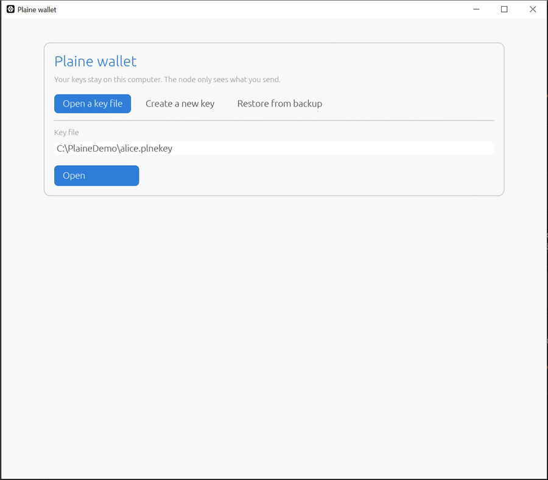
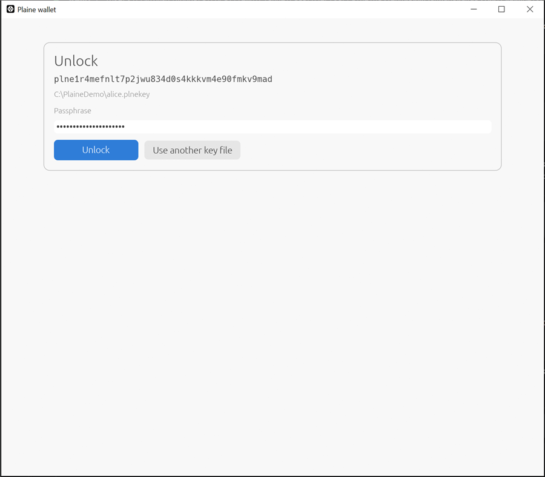
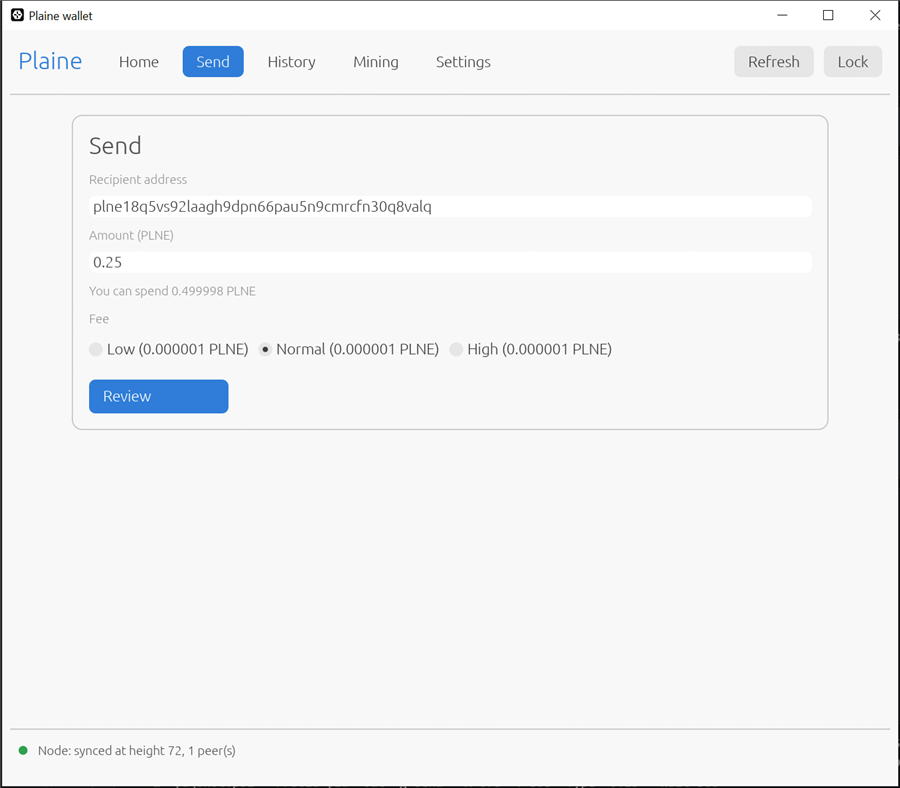
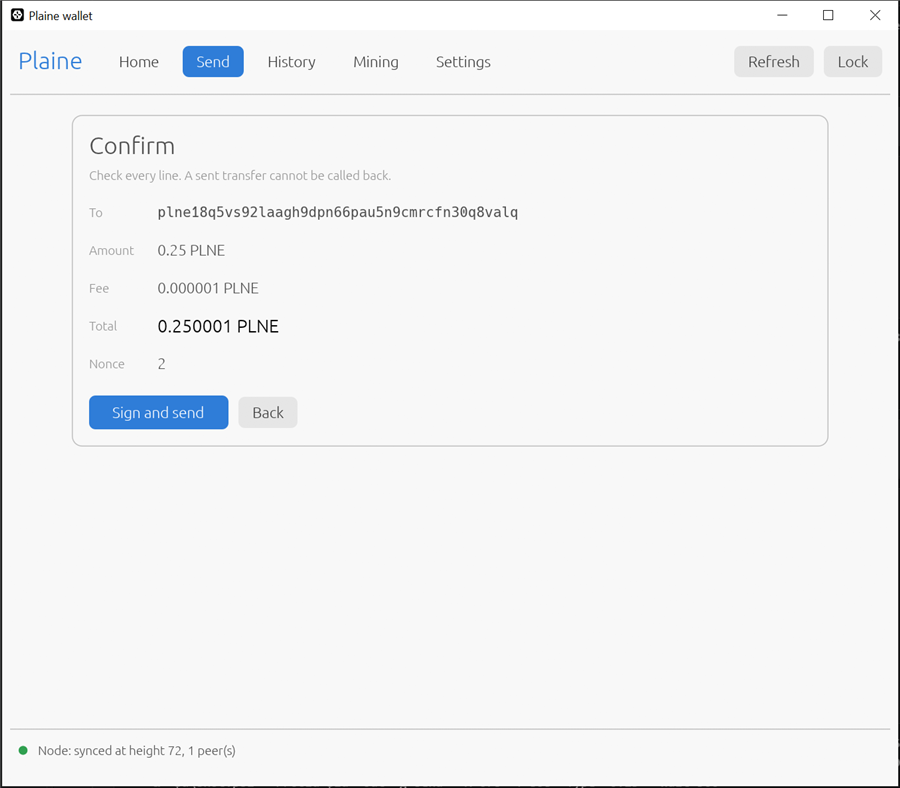
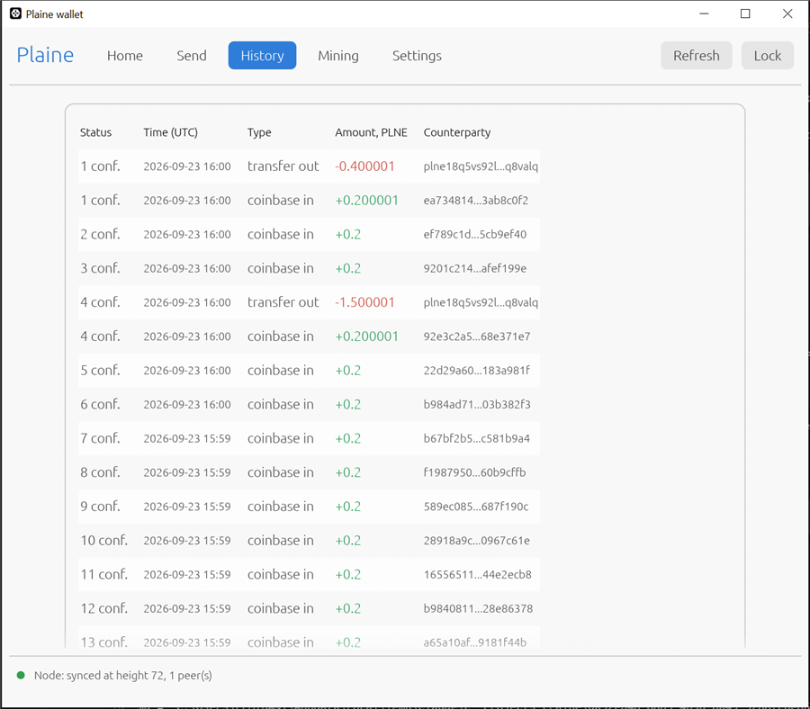
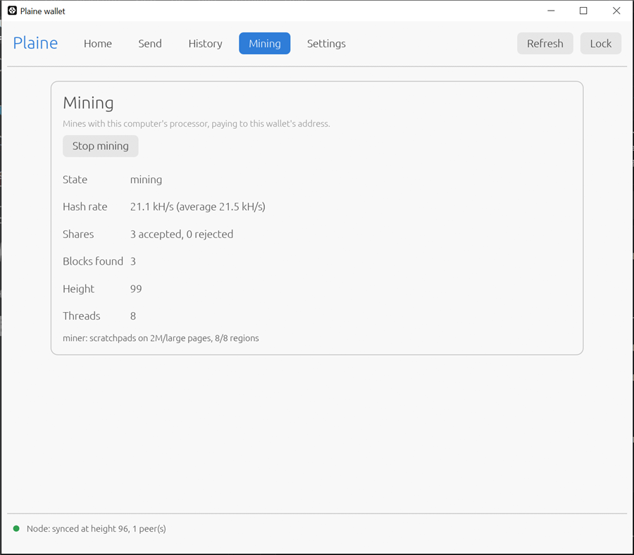
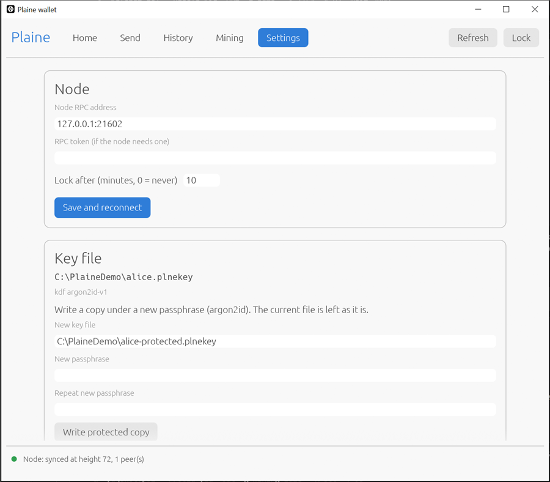

# User guide

How to run a Plaine node, keep your coins in the desktop wallet, send and receive, and
mine, on a computer or a phone. The screenshots come from a demo chain; your numbers will
differ.

- [What you need](#what-you-need)
- [1. Run a node](#1-run-a-node)
- [2. Open the wallet](#2-open-the-wallet)
- [3. Receive](#3-receive)
- [4. Send](#4-send)
- [5. History](#5-history)
- [6. Mine](#6-mine)
- [7. Settings and backup](#7-settings-and-backup)
- [Mining on a pool](#mining-on-a-pool)
- [Mining on an Android phone](#mining-on-an-android-phone)
- [Command line](#command-line)
- [Troubleshooting](#troubleshooting)

## What you need

The release archive for your system, from the
[releases page](https://github.com/danifest751/plaine/releases). The Windows archive has
everything; unpack it anywhere.

| program | what it is |
|---|---|
| `plaine-noded` | the node: follows the chain, checks every block, relays transactions |
| `plaine-wallet-gui` | the desktop wallet |
| `plaine-miner` | the CPU miner |
| `plaine-wallet` | the command-line wallet |
| `plaine-wallet-cli` | the same command line, able to open key files the desktop wallet writes |

The wallet holds your key; the node holds none. The wallet talks only to your own node.

## 1. Run a node

Start `start-node.bat` (Windows) or `./plaine-noded --config noded.toml` (Linux). The node
finds the network through its built-in seeds and downloads the chain; a few minutes the
first time. It keeps running in its window; close the window or press Ctrl+C to stop it.

The `noded.toml` shipped in the archive turns on the address index (`addrindex = true`)
and keeps every block (`prune = false`), which is what the wallet's History tab needs. A
node without them works too; the wallet then lists only what you sent from it.

The node's RPC listens on `127.0.0.1:9257` and its mining server on `127.0.0.1:9258`:
this computer only. To mine from other machines against it, set `listen =
"0.0.0.0:9258"` under `[stratum]`.

## 2. Open the wallet

Start `plaine-wallet-gui`. The first screen offers three ways in.



- **Open a key file** you already have. A key made by `plaine-wallet` opens as it is,
  encrypted or not.
- **Create a new key.** Choose a passphrase of at least 12 characters, or press
  *Suggest a passphrase* for a random one. The key is sealed with argon2id, which costs
  64 MiB of memory per guess, so a stolen file is expensive to attack. Right after, the
  wallet shows the **backup string** once: 68 characters that restore the key anywhere.
  Write it on paper.
- **Restore from backup**: type the 68-character string. Its last four characters are a
  checksum, so a typo is caught instead of restoring a different, empty wallet.

An encrypted key asks for its passphrase:



*Lock* (top right) closes the key; the wallet also locks itself after 10 minutes without
use. Mining goes on while it is locked.

## 3. Receive

**Home** shows what you can spend now, coins still maturing (a mined reward waits 60
blocks, about an hour), and your address with a QR code. Give the address, or let the
payer scan the code.


## 4. Send

**Send**: paste the recipient's address, type the amount in PLNE, pick a fee. The fees
come from what transfers paid in the last 240 blocks; *Normal* is the median.



*Review* checks the address and that you have enough, then shows everything once more.
Nothing is signed until you press *Sign and send*.



A transfer is usually in the next block, about a minute. It shows as *pending* in History
until then.

## 5. History

Pending transfers first, then confirmed ones, newest first: coins received in green,
coins sent in red. Hover over an address to see it whole; *Load more* pages further back.



## 6. Mine

**Mining** runs `plaine-miner` with your processor, paying to this wallet.
*Background* uses half the cores at idle priority, so the computer stays usable;
*Maximum* uses all of them. By default it mines to your own node (`127.0.0.1:9258`); any
stratum server, a pool's included, works.



A share is proof of work sent to the node or pool; a block pays 0.2 PLNE plus its fees.
Solo on your own node you are paid only for the blocks you find; on a pool, a share of
every block the pool finds.

## 7. Settings and backup



- **Node**: its RPC address, and a token if the node asks for one.
- **Key file**: write a copy of your key under a new passphrase. An old, unencrypted key
  file gets its protected copy here; delete the old file yourself once the copy opens and
  your backup is safe.
- **Backup**: show the 68-character backup string again, after the passphrase. Copying it
  wipes it from the clipboard after 60 seconds.

## Mining on a pool

The miner mines to any stratum pool that runs Plaine (Isochron). For rplant.xyz:

```
plaine-miner plne1youraddress.rigname@eu.rplant.xyz:17190
```

`mine-pool.bat` in the Windows archive does the same; put your address in it first.
`plaine-miner` speaks plain TCP, not TLS, so leave out `--tls`.

## Mining on an Android phone

The `plaine-miner-android-arm64` binary runs on 64-bit Android phones from a shell, for
example through `adb` from a computer:

```
adb push plaine-miner /data/local/tmp/
adb shell chmod 755 /data/local/tmp/plaine-miner
adb shell /data/local/tmp/plaine-miner plne1youraddress.phone@eu.rplant.xyz:17190
```

It uses the phone's fastest cores first. A Poco X3 Pro (Snapdragon 860) does about
5 kH/s. A phone mining at full load gets hot and drains its battery; keep it cool and
on a charger.

## Command line

The command-line wallet never touches the network: it signs, and you submit through the
node's RPC. See `plaine-wallet --help`, and [rpc.md](rpc.md) for every RPC method.

```
plaine-wallet new --out my.plnekey --role spend --passphrase-file pass.txt
plaine-wallet address --in my.plnekey
plaine-wallet transfer --in my.plnekey --to plne1... --amount 5plne --fee 1mile \
    --nonce 0 --passphrase-file pass.txt
```

`plaine-wallet-cli` takes the same commands and adds `--kdf argon2id`, and opens the key
files the desktop wallet writes.

## Troubleshooting

| you see | what to do |
|---|---|
| `Node: cannot reach the node` | Start the node, or fix its address under Settings. |
| `Node: syncing` | Wait: the node is still downloading the chain. |
| History says the node keeps no address history | Run the node with `addrindex = true` (the shipped `noded.toml` does); a node started before needs a resync, into an empty data directory, to index the past. |
| `MAC mismatch` when unlocking | The passphrase is wrong. |
| A send refused with `insufficient-funds` | Mined coins mature after 60 blocks; *Spendable* on Home is what you can send. |
| Mining shows `cannot start` | Point *Miner program* at `plaine-miner.exe`. |
